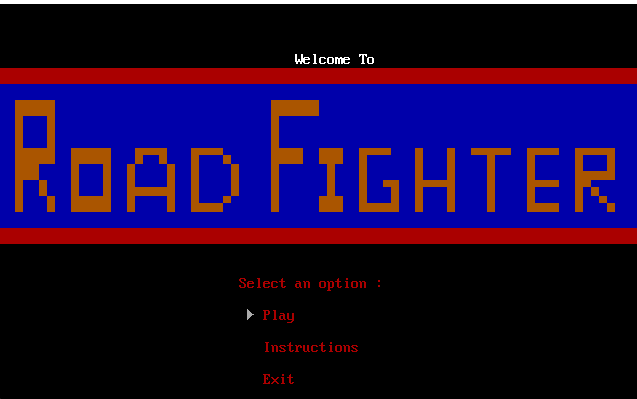
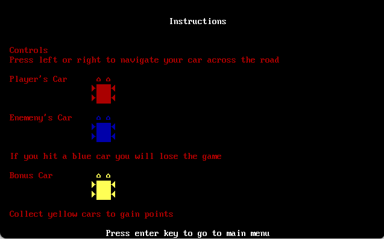
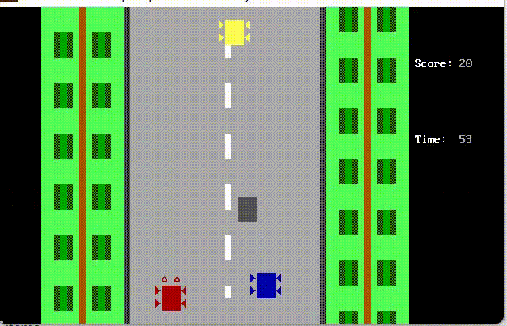
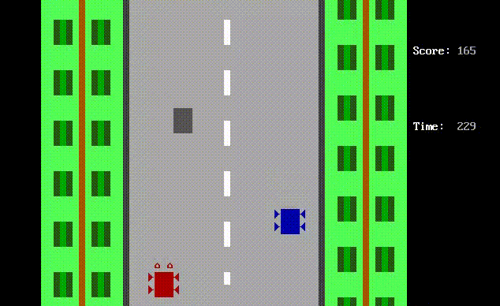
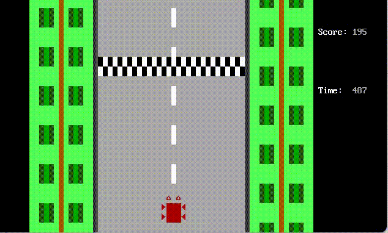
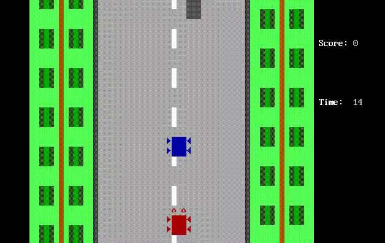

# RoadFighter x86
An x86, Assembly Language replica of the classic arcade Road Fighter game developed by KONAMI for NES. Made for Intel 8088 processor.

## START SCREEN

## INSTRUCTIONS

## GAMEPLAY

## OBSTACLES (-5 score)

## VICTORY

## GAME OVER

# CONTRIBUTOR
@zaigham-kashif
